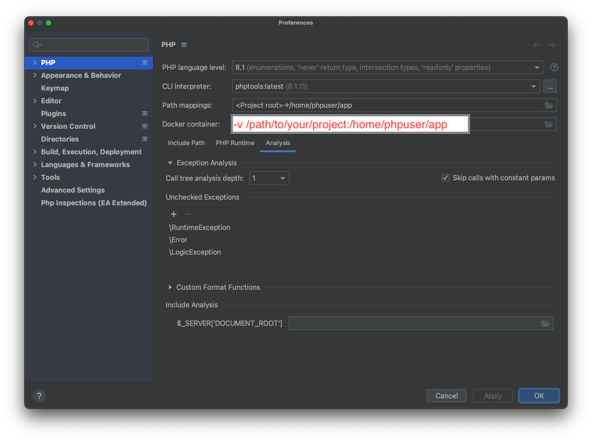
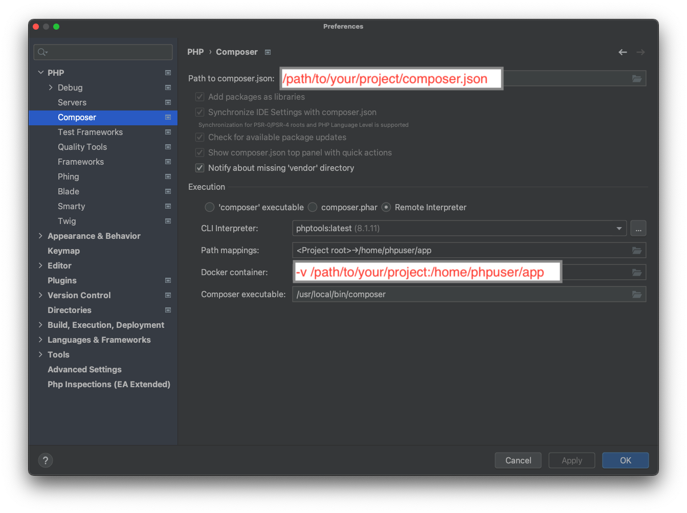
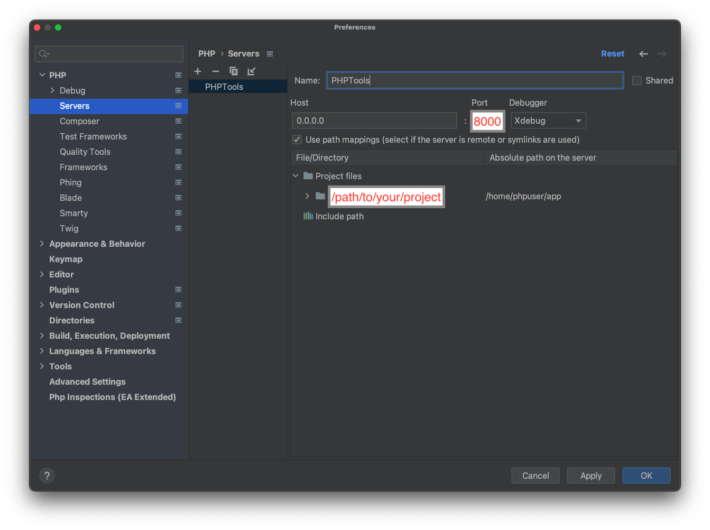

# PHPTools

PHPTools is a Docker-based virtual environment that allows you to develop PHP applications on systems that don't have PHP installed (e.g. recent macOS).

PHPTools comes with the following packages pre-installed:

 - [Xdebug](https://xdebug.org/) (disabled by default)
 - [Composer](https://getcomposer.org/)
 - [PsySH](https://psysh.org/)
 - [PHPCodeSniffer](https://github.com/squizlabs/PHP_CodeSniffer)
 - [Psalm](https://psalm.dev/)
 - [PHPUnit](https://phpunit.de/)
 - [libyear](https://libyear.com/)


## Requirements

 - Docker installed on the target system
 - Your `~/bin` directory must be included in the `$PATH` variable


## Installation

```shell
$ cd /path/to/phptools
$ sh build.sh && sh install.sh
```

The installation script creates links to the binaries above into your home directory (`~/bin`) so you can use them like they were installed locally.

The `uninstall.sh` script will remove all the links.


## Usage

You can run any of the installed tools as they were in your local machine, and the current working directory will be mapped into the Docker container.

You can also run:
  - `php`
  - `phptools shell` (to open a shell into the container)
  - `phptools version` (to display the current version of PHPTools)

The development server runs by default on port 8000, which is also exposed by the container.

### Environment files

If a file named `.env` is present in the current working directory, it will be injected intto the Docker environment (`php` executable only).

## Debugging

Xdebug is disabled by default, in order to enable it you need to run the tools with the `--debug` switch as first argument. For example:

```shell
$ php --debug -S 0.0.0.0:8000
```

### IDE Integration

If you use [PHPStorm](https://www.jetbrains.com/phpstorm/), you can set up your project's environment using the following screenshots as reference, assuming your IDE debugger is listening to ports 9000 or 9003 (default settings).







The server's name (default `PHPTools`) must match with the `PHP_IDE_CONFIG` value (default is `serverName=PHPTools`).


## Custom settings

You can add your custom settings by injecting additional INI files into the PHPTools container, see the example below for the basic PHP interpreter.

```shell
# ...other code...

docker run --rm -it \
  -v $PWD:/home/phpuser/app \
  -v $DIR$DEBUG_FILE:/usr/local/etc/php/conf.d/docker-php-ext-xdebug.ini \
  -v /path/to/your/local/settings.ini:/usr/local/etc/php/conf.d/custom-settings.ini \
  -p 8000:8000 \
  -e PHP_IDE_CONFIG="serverName=PHPTools" \
  phptools:latest "$@"
```
